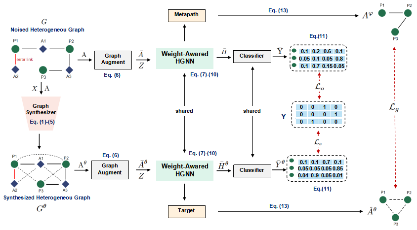

# NoiseHGNN

This repo is for the source code of NoiseHGNN, AAAI 2025 paper.

>Zhang xiong, Cheng Xie, Haoran Duan, Beibei Yu.  NoiseHGNN: Synthesized Similarity Graph-Based Neural Network For Noised Heterogeneous Graph Representation Learning
# Overview



# Dataset
We provide datasets for **ACM**,**DBLP**, **Freebase**,**IMDB** and **PubMed_NC**.

# running environment
* python 3.10.14
* torch 1.13.1+cu117
* dgl 1.0.1+cu117
* torch_geometric 2.2.0
* networkx 2.8.4
* scikit-learn 1.4.1
* scipy 1.12.0

# Run
```
python run_new.py --dataset DBLP
python run_new.py --dataset ACM --feats-type 2
python run_new.py --dataset Freebase
python run_new.py --dataset PubMed_NC --feats-type 2
python run_multi.py --dataset IMDB --feats-type 0
```


